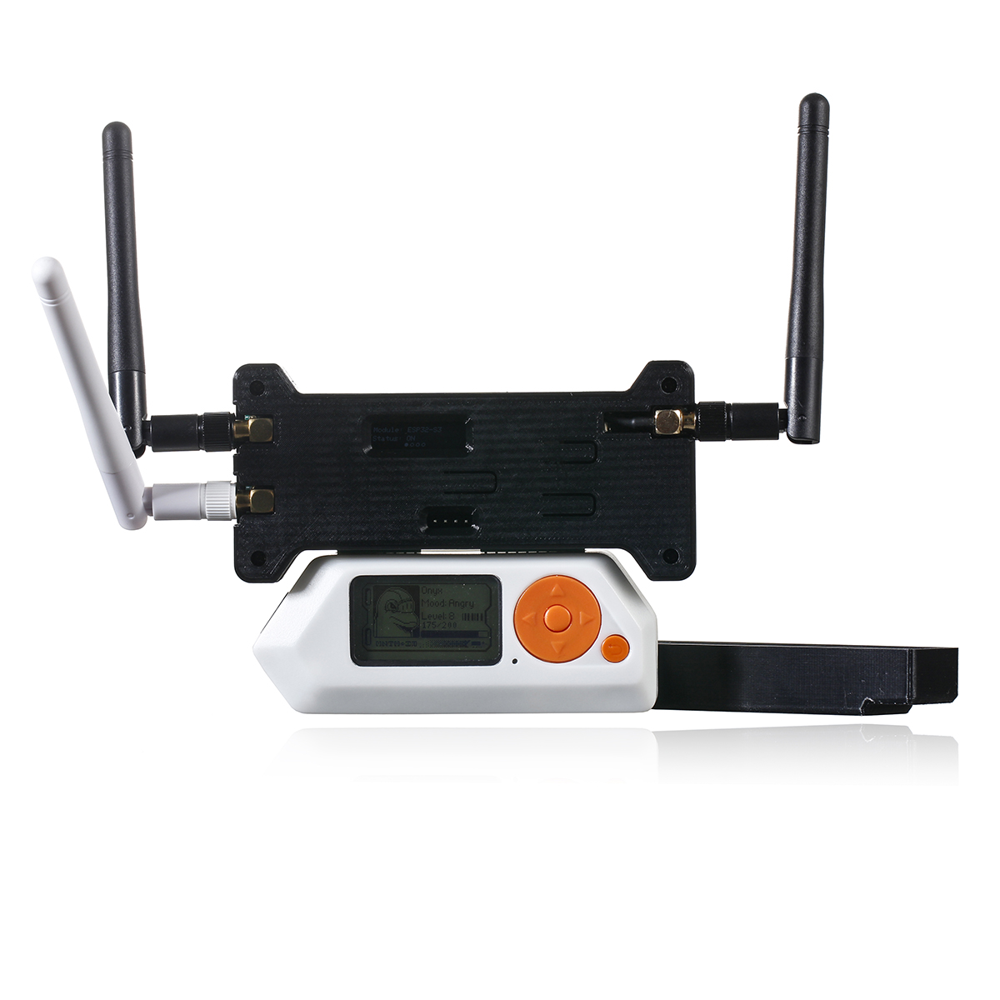
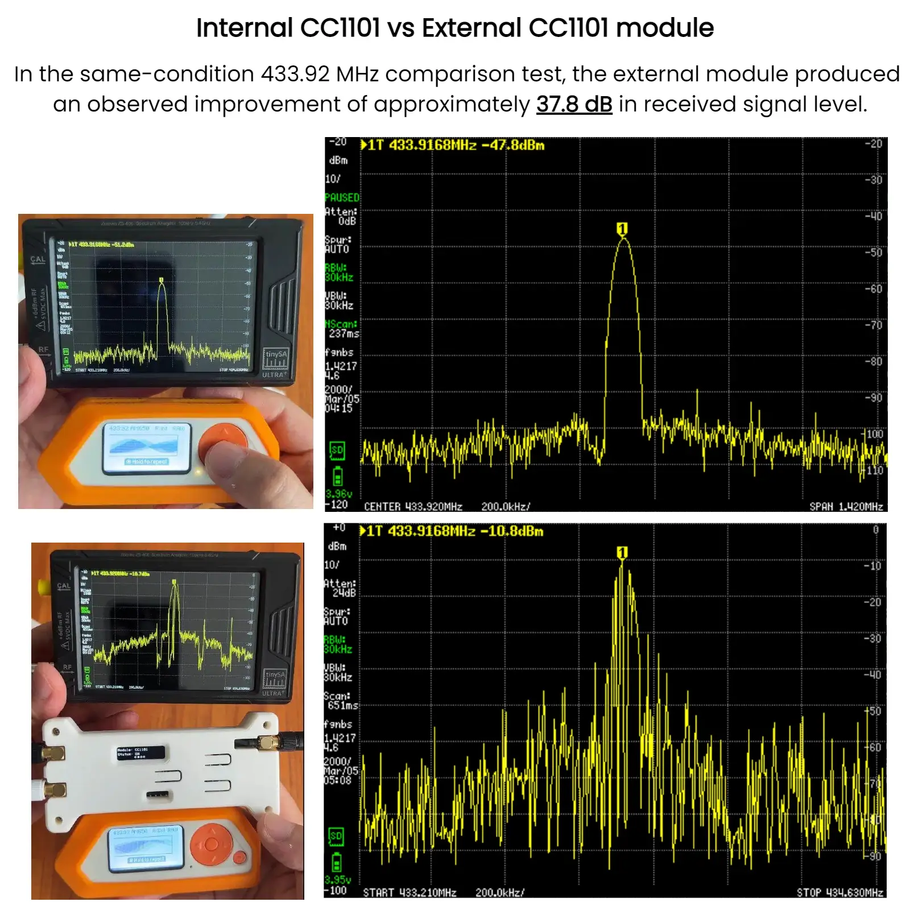

# Flipper Zero 4-in-1 Multiboard

The Flipper Zero 4-in-1 Multiboard combines ESP32-S3, NRF24, CC1101, GPS, a 0.91-inch OLED screen, antennas, and a protective case into one compact expansion board.

Product link: https://kutoubee.com/product/flipper-zero-4-in-1-multiboard/

## External CC1101 Signal Improvement

The board includes an external CC1101 sub-GHz radio module with an external antenna connector.

Compared with the built-in Flipper Zero sub-GHz radio, the external CC1101 module can provide stronger measured signal levels under the same basic test conditions.

## Signal Level Comparison

Check video of the testing here: https://www.youtube.com/shorts/tDweoz1FHr4
| Test Item | Observed Signal Level |
|---|---:|
| Flipper Zero built-in sub-GHz radio | approx. -47.8 dBm |
| 4-in-1 Multiboard external CC1101 | approx. -10.0 dBm |
| Observed improvement | approx. +37.8 dB |

## Test Summary

In this comparison, the external CC1101 module on the 4-in-1 Multiboard produced an observed signal level improvement of approximately **37.8 dB**.

This suggests that using an external CC1101 module with a suitable external antenna can significantly improve measured sub-GHz signal performance compared with the built-in radio path.

## Integrated Modules

- ESP32-S3
- NRF24
- CC1101
- GPS
- 0.91-inch OLED screen
- External antennas
- Protective case with pin guard
